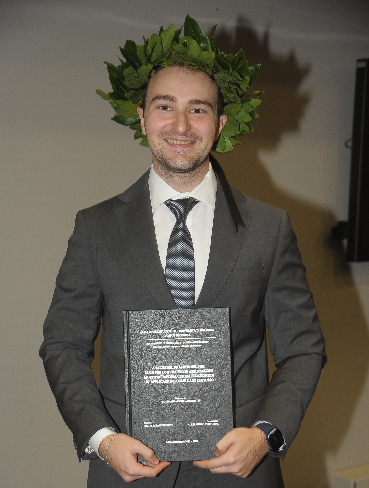

<h1 style="text-align:center; font-size:30px"> Curriculum Vitae - Alessandro Venturini</h1>

## Personal information

> 
>
> |||
> | ------------- | -------------------------------------------------------------- |
> | Name          | **Alessandro Venturini**                                       |
> | Date of Birth | **21/08/2000**                                                 |
> | Nationality   | **Italian**                                                    |
> | Address       | **Via Riva di Reno 126 (Bologna)**                             |
> | E-mail        | **[ales.ventus21@gmail.com](mailto\:ales.ventus21@gmail.com)** |
> | Phone         | **331 3534898**                                                |
> | GitHub        | **[Ventus218](https://github.com/Ventus218)**                  |

## Work experience

##### *March 2023 - June 2023*

> 150-hour curricular internship at [Oltre Solutions s.r.l.](https://www.oltresolutions.com) where I rewrote an Android application and ported it to iOS using Xamarin.Forms.
>
> The application is currently in production on the [App Store](https://apps.apple.com/it/app/load-manager/id6448108872?platform=iphone).

## Education

##### *July 2019*

> Graduated from Liceo Scientifico Augusto Righi in Bologna

##### *September 2019 - September 2021*

> Attending bachelor's degree program in computer engineering at the University of Bologna

##### *September 2021 - June 2023*

> Attending bachelor's degree program in Computer Engineering and Computer Science at the University of Bologna

##### *October 2023*

> Bachelor’s degree in Computer Engineering and Computer Science (106/110)
>
> Thesis: **[ANALISI DEL FRAMEWORK .NET MAUI PER LO SVILUPPO DI APPLICAZIONI MULTIPIATTAFORMA E REALIZZAZIONE DI UN’APPLICAZIONE COME CASO DI STUDIO](https://amslaurea.unibo.it/29785/)**

##### *September 2023 - Present*

> Pursuing a master’s degree in Computer Engineering and Computer Science at the University of Bologna

## Personal skills and experience

##### Native language

> Italian

##### Other languages

> - English:
>   - Reading Comprehension: **Very Good**
>   - Writing Skills: **Very Good**
>   - Oral Expression: **Good**

##### Personal growth

> ##### *September 2018 - 2023*
>
> Participation in the continuous personal growth program *Soft Skills Academy*

## Technical skills

##### Programming, markup, and style languages

> | Language       | Level         |
> | -------------- | ------------- |
> | Scala          | **Advanced** |
> | Swift          | **Advanced** |
> | Java           | **Advanced** |
> | C#             | **Proficient** |
> | C              | **Proficient** |
> | SQL            | **Proficient** |
> | Shell          | **Proficient** |
> | Markdown (.md) | **Proficient** |
> | HTML           | **Proficient** |
> | CSS            | **Proficient** |
> | Python         | **Intermediate** |
> | Javascript     | **Intermediate** |
> | PHP            | **Intermediate** |
> | Gleam          | **Intermediate** |
> | Prolog         | **Beginner**     |
> | Typescript     | **Beginner**     |

##### Technologies

> - Operating Systems:
>   - MacOS
>   - Linux
>   - Windows
>
> - DBMS:
>   - PostgreSQL
>   - MySQL
>   - DB2
>
> - IDE:
>   - VisualStudioCode
>   - XCode
>   - VisualStudio
>   - IntelliJ IDEA
>   - Eclipse
>   - DataGrip (Beginner)
>
> - Frameworks:
>   - SwiftUI (iOS)
>   - UIKit (iOS)
>   - [Vapor](https://github.com/vapor/vapor) (Server Side Swift)
>   - Xamarin.Forms
>   - .NET MAUI
>   - Akka
>   - Vue (Beginner)
>   - JavaFX (Beginner)
>   - Bootstrap (Beginner)
>
> - Git
> - Docker
> - Docker compose
> - Kubernetes
> - Kafka (Beginner)
> - Unity and Game Development (Beginner)
> - Terraform (Beginner)
> - VirtualBox (Beginner)

## Projects

I have always enjoyed developing personal projects to grow my technical skills. You can explore some of the ones I’m most proud of on [my GitHub profile](https://github.com/Ventus218).

## Additional information

##### Driver’s license

> B (Owns a car)

##### About me

> I am deeply passionate about Computer Science, with a strong focus on its engineering aspects. I am curious, tenacious and I always strive to add a personal touch into my work.
>
> My top two priorities are:
> - Delivering high-quality software is my top priority, and I am committed to continuous improvement in every project I undertake.
> - Enjoying work and building meaningful relationships with my colleagues.
> 
> Currently, I am particularly intrigued by functional programming and its potential to increase software quality.
>
> Looking ahead, I'd like to contribute to the development of software or tools to be used by developers.
